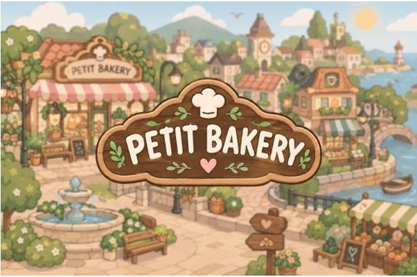
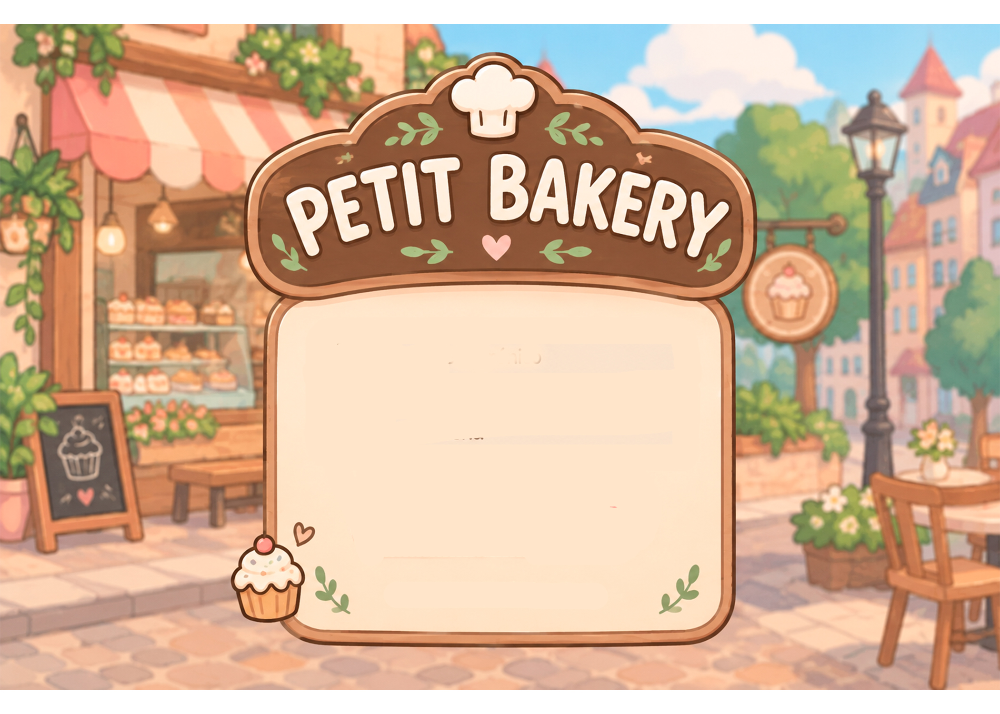
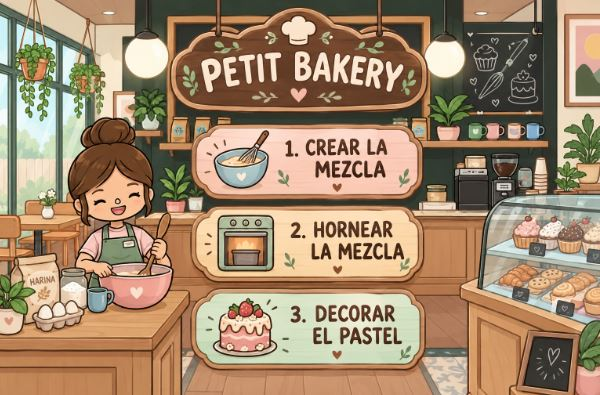
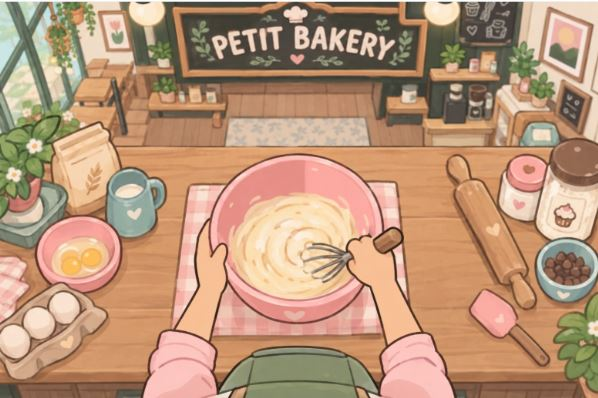
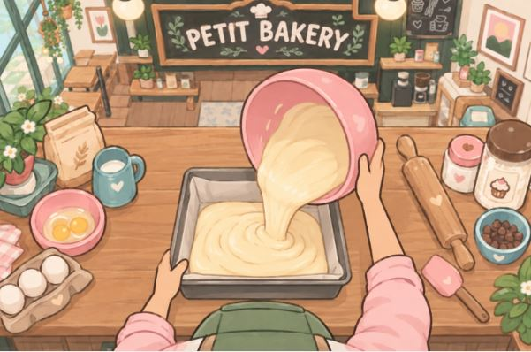
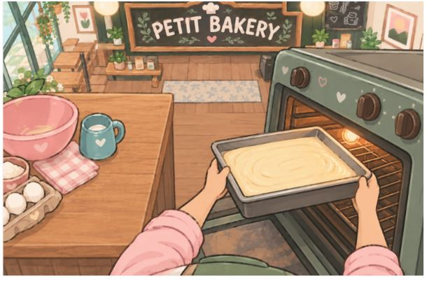
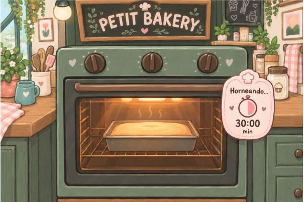

# PETIT BAKERY

## INTEGRANTES
| Nombre y apellido | Rol principal | Usuario de GitHub |
|---|---|---|
| Sofia Streuli | [] | SofiaStreuli|
| Catalina Gonzalez Cerezal | [] | cgonzalescerezal |
| Avril Polvera | [] | apolvera |
| Felicitas Scarfo | [] | felicitasscarfo |

Repositorio del trabajo final de 5to año A informática, grupo 07.

# 1. Documento de Alcance y Planificación

## 1.1 Descripción del proyecto

**Nombre de la aplicación:** Petit Bakery
**Descripción general:**
Petit Bakery  es una aplicación web multijugador competitiva en tiempo real donde dos usuarios se enfrentan en un duelo de cocina para preparar el pastel pedido en el menor tiempo posible. Los jugadores deberán avanzar en la receta lo más rápido para que el oponente no logre enviarle penalizaciones (como sumar tiempo a su reloj o activar distracciones en pantalla), la persona que logre completar el pastel más rápido sumará el mayor puntaje y ganará el juego .

**Problematica / Necesidad que aborda:**
La problemática que aborda es que hay que poder crear las pastelas de la manera más rápida para poder ganarle al enemigo.

**Publico Objetivo:**
Usuarios que jueguen en la expoPio. Por ejemplo alumnos, padres, profesores, etc.

**Objetivo General:**
El objetivo del juego es crear los pasteles más rápido que el oponente

## 1.2 Alcance

### Funcionalidades que serán desarrolladas

| N.º | Módulo | Funcionalidad | Descripción | Tipo de usuario | Comunicación |
|---|---|---|---|---|---|
| 1 | Autenticación y perfiles | Registro de usuarios | Alta de nuevos jugadores con sus datos de cuenta. | Jugador | HTTP |
| 2 | Autenticación y perfiles | Inicio de sesión | Login de jugadores y administradores, con manejo de sesión y roles. | Jugador / Administrador | HTTP |
| 3 | Autenticación y perfiles | Panel de administrador | Gestión de usuarios y recetas (alta, consulta, modificación y baja), y visualización del historial global de partidas. | Administrador | HTTP |
| 4 | Lobby y emparejamiento | Creación de salas | El jugador crea una sala (lobby) de juego y queda a la espera de un rival. | Jugador | WebSocket |
| 5 | Lobby y emparejamiento | Unirse a una sala | Un segundo jugador se une a una sala existente y se conectan los dos competidores. | Jugador | WebSocket |
| 6 | Lobby y emparejamiento | Sincronización de la partida | Estado de la partida y temporizador central sincronizados entre ambos clientes. | Jugador | WebSocket |
| 7 | Mecánica de juego | Armado de pastel por capas | Construcción progresiva del pastel superponiendo imágenes PNG transparentes según los ingredientes elegidos. | Jugador | Frontend |
| 8 | Mecánica de juego | Pasos de la receta | Selección de los ingredientes correctos según la receta asignada a la partida. | Jugador | HTTP / WebSocket |
| 9 | Mecánica de juego | Minijuegos rápidos | Mecánica de batido y horneado mediante pulsación rápida de teclas para avanzar de etapa. | Jugador | Frontend |
| 10 | Ataques y penalizaciones | Sumar tiempo al rival | Al completar una fase de forma rápida o perfecta, se envía un evento que suma segundos al cronómetro del oponente. | Jugador | WebSocket |
| 11 | Ataques y penalizaciones | Distracción visual | Activación de un efecto temporal sobre la pantalla del oponente (por ejemplo, una capa de humo). | Jugador | WebSocket |
| 12 | Persistencia y ranking | Registro de resultados | Se guardan en la base de datos el ganador, el perdedor y el tiempo total de preparación de cada partida. | Sistema | HTTP |
| 13 | Persistencia y ranking | Ranking público | Tabla de posiciones con los jugadores con más victorias y mejores tiempos. | Todos | HTTP |

## 1.3 Tabla de planificacion

### Tabla de tareas

| Objetivo | Tareas asociadas | Responsable(s) | Fecha estimada de finalización |
|---|---|---|---|
| AUTENTICACION | login y registro, usuario admin |  [SofiaStreuli] | 10/10 |
| BACKEND BASE | Servidor en `index.js`, rutas HTTP | [Integrante] | ?/10 |
| FRONTEND BASE | Estructura Next.js, páginas, componentes, uso de Fetch | [Integrante] | ?/10 |
| BASE DE DATOS |creacion de tablas, relacion de entidad | [Integrante] | ?/11 |
| TIEMPO REAL | Servidor WebSocket y hook `useSocket.js` | [Integrante] | ?/11 |
| Cierre | Pruebas, correcciones, DER final, usuario admin para docentes | Todos | 17/11 |
| Presentación | Preparación de la demo para la Expo Pio | Todos | 19/11 |

## 1.4 Diseño inicial
**Wireframes / bocetos de las pantallas principales**

Herramienta utilizada: [Figma / Canva]. Enlace: [URL]

| Pantalla | Boceto |
|---|---|
| Pantalla principal |   |
| Login / Registro | |
| Juego |          |
| Panel de administrador | `` |

